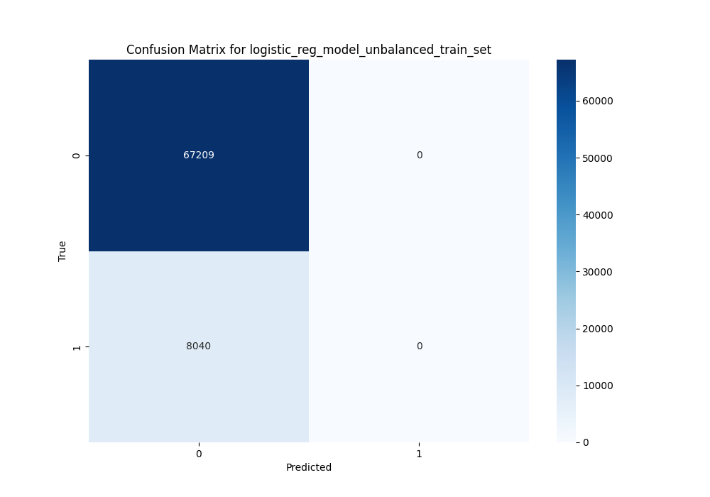
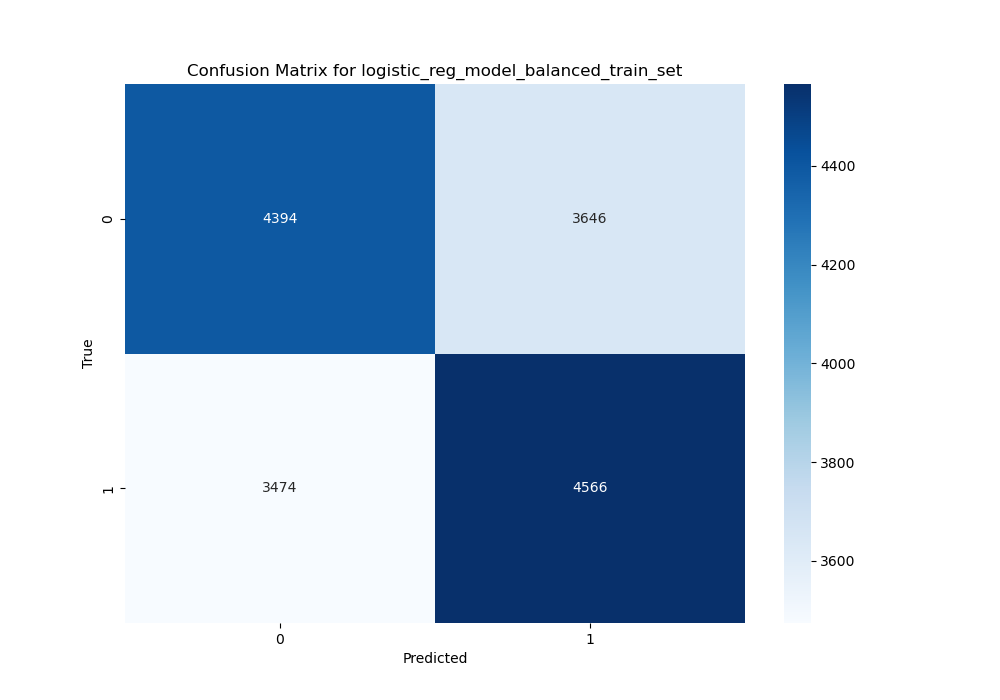
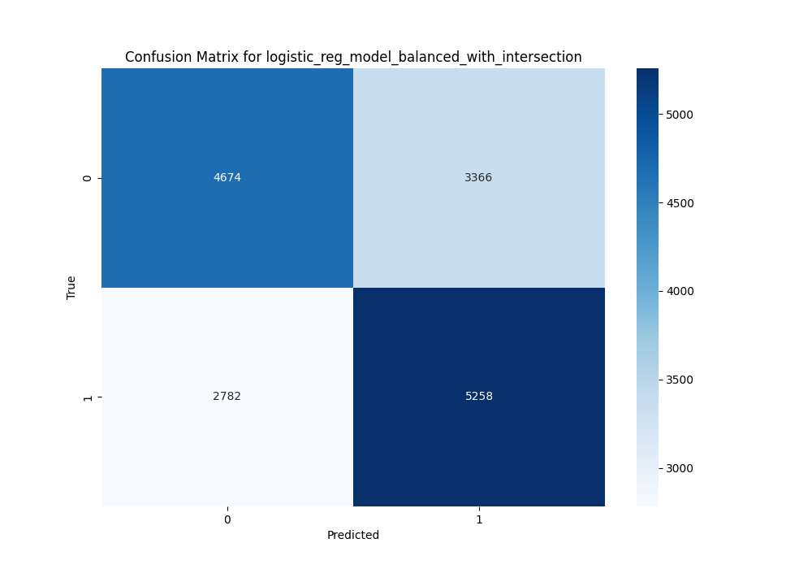
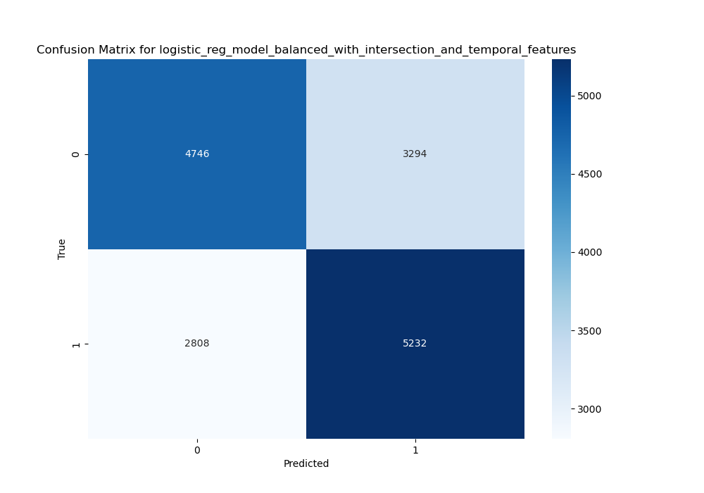

# Data Preprocessing for "San Francisco Incident Reports" Analysis

Google Collab link (May not be able to view notebook on Github due to size): https://colab.research.google.com/github/zhubzy/SF-Incident-Prediction/blob/main/SF_Incident_Prediction.ipynb

This README highlights the steps for preprocessing the "San Francisco Incident Reports (2018-present)" dataset for classifying incidents into "violent" and "non-violent" categories based on location and time information. The document will guide through data cleaning and transformation to prepare the dataset for analysis using feedforward neural networks.

## Data Cleaning

### 1. Handle Missing Values

- **Numerical columns**: Identify and fill missing values in columns like `longitude` and `latitude`. we will use the mean or median of the column for filling in the missing values.
- **Categorical columns**: For columns with categorical data such as `Intersection`, we will fill missing entries with the most frequent value or a placeholder such as 'Unknown'.

### 2. Remove Outliers

- Use statistical methods to identify and remove outliers from numerical columns like `longitude` and `latitude`. We will use the Interquartile Range (IQR) method for this purpose.

## Data Transformation

### 1. Normalization

- We will normalize numerical features to ensure they're on the same scale. This is crucial for features like `longitude` and `latitude`. We will use the z-score normalization to achieve this.

### 2. Extract Target Variable

- We will manually classify incidents into "violent" and "non-violent" categories using the `Incident Category` column. For example, we may classify "Larceny Theft" as a "non-violent" act and "Assault" as a "violent" act in the column.

### 3. Categorical Feature Encoding

- We can use one-hot encoding technique for converting categorical data into a binary vector, such as converting "non-violent" to `0` and "violent" to `1`.

## Splitting

### 1. Split the data

- After completing the data cleaning and transformation steps, we will split the dataset into training and testing sets to be used by our models.

## Milestone 3: Model 1 - Logsitc Regression

We first finished pre-processing by extracting the dattime in string to numerical categories (day, month, year, etc) then applying z-score standardization to all the appropriate columns before the data is ready for training.

We then begin to build and experiment with a simple logistic regression model.

Due to class imbalance, we achieved 89% accuracy with the prediction tasks but along with 0% precision and 0% recall. Upon inspecting the confusion matrix we observe that the model is predicting any incident to be "non-violent". In this case accuracy is not a good metric of performance due to the class imbalance and we want to figure out contributing factors for a crime to be violent. Further data processing is needed (resampling the dataset to be balanced).

In a second attempt, we changed our sample technique to account for this. On the new training set, we include an even 50-50 split of both classes from resampling, and we end up with an F1 score of 0.56 for these new tasks.

We then experimented with more feature extraction. We added additional features into our dataset by one hot encoding the intersection (so our model knows what community the crime is happening), and this raised the accuracy to 62%. Adding temporal features such as isWeekend, timeOfDay (morning, afternoon, evening) did not help improve the results.

## Conclusion
In conclusion, with some feature engineering, we are able to achieve a F1 score of 0.63 with our simple logistic regression model. Through this experiment, we found out that the broad location of crime (intersection) seems to be an important contributing factor to whether a crime is violent or not as one hot encoding it increased our performance metrics (F1 score) marginally.

Logistic regression assumes a linear relationship between the features and the log-odds of the target variable. If the relationship is non-linear, logistic regression may not perform well. For the next two models, we could incorporate non-linear transformations of the features or use more complex models like decision trees or neural networks. Crime patterns can vary significantly over time and across different locations. If the model doesn't account for these temporal and spatial dynamics adequately, its predictive performance may suffer. In addition, we can consider incorporating time and location-specific features or using techniques like spatial or temporal clustering.

For the next two models, we want to try SVC classifiers and neural networks, as they are well-suited for complex datasets with high-dimensional features. They can effectively handle datasets with a large number of features, which we would expect to have after more feature extraction and engineering just like we did this milestone with the intersection.
