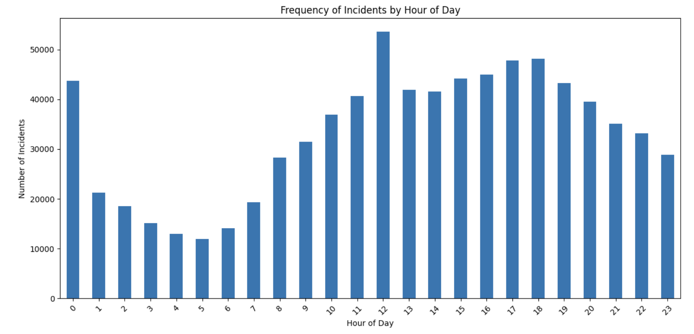
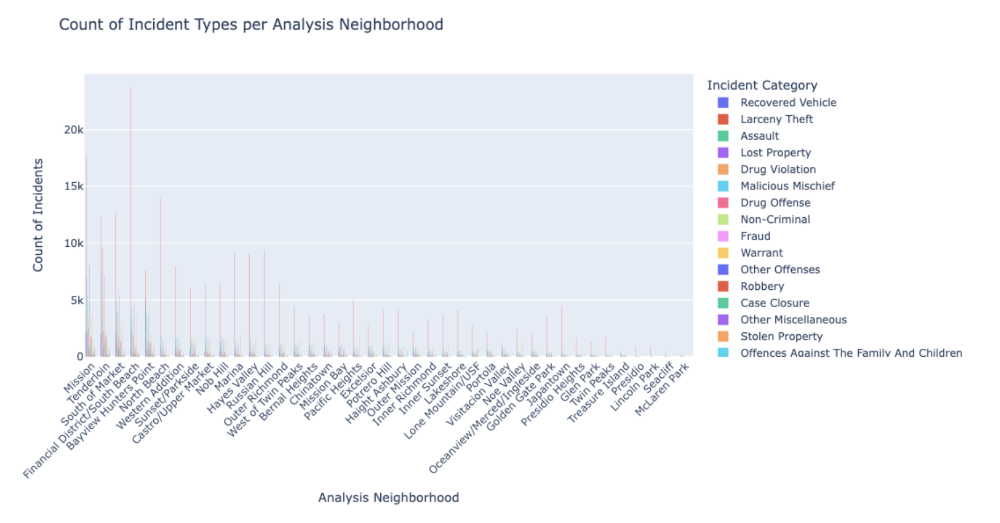
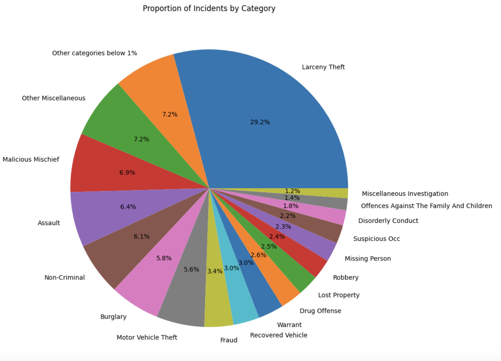
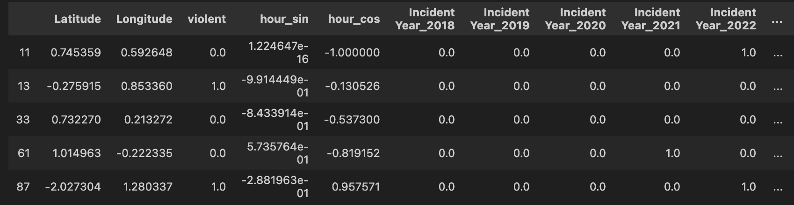
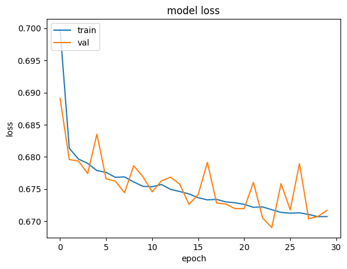
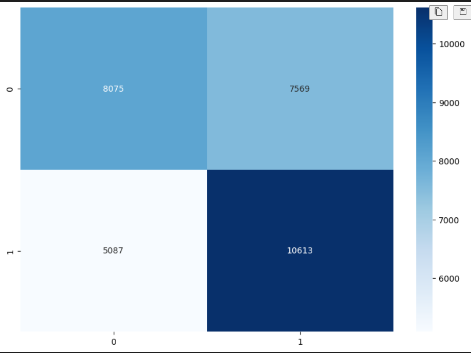

# Group Project Final Report <San Francisco Incident Prediction Project>

## Introduction

Law enforcement agencies and emergency responders are often tasked with assessing the potential severity and violence level of reported incidents. Having an accurate assessment of whether an incident is likely to involve violence can help guide the appropriate response, allocation of resources, and safety precautions for personnel responding to the scene. However, making this determination based solely on limited initial report details can be challenging and prone to human bias or error.

Our final project on San Francisco Incident Prediction aims to predict the nature of crime incidents (violent or not) based on time and location in San Francisco. It showcases our deep interests and understandings of the complexities involved in crime prediction within a city and the potential benefits of addressing this challenge.

The San Francisco Incident Prediction project represents a pivotal application of data science to enhance urban safety and improve policing strategies. By predicting the nature of crime incidents using temporal and spatial data, this initiative stands at the forefront of a proactive approach to public safety, with the aim of being both innovative and impactful, that also explains why we chose this as our final project topic.

### Project Significance

The relevance of this project is underscored by its direct impact on law enforcement agencies, urban planners, and communities. Predictive modeling of crime incidents based on nuanced factors such as time and place allows for precision in public safety measures, offering a tailored strategy for addressing specific criminal activities.

#### Data Utilization

The methodical use of time and location data, complemented by advanced feature engineering techniques, illustrates an astute deployment of available information. This project exemplifies the shift towards data-driven decision-making in urban management, replacing intuition-based methods with evidence-based practices.

#### Technical Rigor

A diverse array of modeling techniques, including logistic regression, neural networks, and SVM classifiers, demonstrates a rigorous analytical process aimed at identifying the most effective model for crime prediction. This approach highlights the adaptability and scalability of our methods, with potential applications extending to other urban settings.

### Broader Impact

Effective predictive models have a profound impact on multiple facets of urban life:

- **Proactive Policing**: Enhanced resource allocation and preemptive intervention capabilities.
- **Community Trust**: Strengthening the bond between law enforcement and the public through transparent, evidence-based practices.
- **Policy Making**: Guiding the development of targeted legislation and community initiatives.
- **Urban Planning**: Informing safer city designs through strategic planning and environmental design considerations.

### Importance of Robust Predictive Models

The necessity for accuracy, adaptability, and efficiency in predictive modeling is paramount. Such models are instrumental in focusing efforts where they are most effective, adjusting to evolving crime trends, and optimizing resource use. In essence, the San Francisco Incident Prediction project is more than an exploration of crime prediction; it's a blueprint for enhancing public safety through the application of technology and analytics, contributing to the creation of safer and more resilient communities.

## Methods

### Data Exploration

#### Incident Datetime Data Exploration

We employed a temporal analysis of the dataset by converting the 'Incident Datetime' column to the datetime data type and setting it as the DataFrame index. We performed a resampling to aggregate incident data on an annual basis, visualizing the trend via a bar graph. We also extracted the hour of the incident to investigate the distribution throughout a day and analyzed the frequency of incidents by each day of the week using a bar graph representation. The temporal analysis indicated a significant decrease in the number of incidents in recent years, with an acute drop in 2020 possibly due to the COVID-19 pandemic, and a continued decrease into 2023. The peak of incident rates occurred around noon and the afternoon, while the hours from 1 AM to 7 AM generally saw the fewest incidents. The day with the most incidents was Friday, with Sunday having the least, although the distribution across the week was relatively even.


_Figure 2.1.1: This relatively more clear bar graph mainly represents the frequency of incidents happening in San Francisco by Hours of Day._

#### Incident Location Data Exploration

Spatial distribution of incidents was analyzed using Plotly Express for interactive visualizations. A Scatter Geo Plot was generated for the first 10,000 incidents post-cleaning, categorized by 'Incident Category' and enhanced with hover details. Additionally, a histogram displayed the frequency of incident types across various San Francisco neighborhoods, grouped by 'Incident Category'. The Scatter Geo Plot centered on San Francisco revealed spatial patterns in incident distribution, with diverse incident categories indicated by different colors. The histogram analysis of neighborhoods showed that 'Financial District/South Beach' had the highest incident counts, with 'Larceny Theft' being the predominant category across most neighborhoods. These visualizations served as tools for understanding the spatial and categorical patterns of crime in San Francisco.


_Figure 2.1.2: This chart displays the count of incident types across different analysis neighborhoods in San Francisco, grouped by incident category. It is designed to offer a comparative view of incident frequencies in neighborhoods, with the neighborhoods ordered by the total number of incidents descending._

#### Incident Category Data Exploration

For the categorical analysis, incident types were quantified, and due to a large number of categories, we divided them into three equal parts for visualization in histograms. We also calculated the proportional distribution of incident categories, consolidating those with less than 1% frequency into a combined category for a pie chart presentation. The categorical analysis revealed 'Larceny Theft' as the most frequent type of crime, dominating the incident categories in San Francisco. The pie chart demonstrated that 'Larceny Theft' accounted for approximately 30% of all incidents, and categories aside from 'Larceny Theft' had relatively similar proportions. Categories with individual proportions under 1% cumulatively formed the second-largest segment with 7.2%.


_Figure 2.1.3: This is a PIE chart showing the proportions of all the incident categories. In order to make the graph look nicer, we combined all the categories with proportion below 1% together to be a new category called "Other categories below 1%"._

### Preprocessing (Steps / Sample output of our final dataframe)

#### Data Preprocessing for "San Francisco Incident Reports" Analysis

Google Collab link (May not be able to view notebook on Github due to size): https://colab.research.google.com/github/zhubzy/SF-Incident-Prediction/blob/main/SF_Incident_Prediction.ipynb

This README highlights the steps for preprocessing the "San Francisco Incident Reports (2018-present)" dataset for classifying incidents into "violent" and "non-violent" categories based on location and time information. The document will guide through data cleaning and transformation to prepare the dataset for analysis using feedforward neural networks.

#### Data Cleaning

##### 1. Handle Missing Values

- **Numerical columns**: Identify and fill missing values in columns like `longitude` and `latitude`. we will use the mean or median of the column for filling in the missing values.
- **Categorical columns**: For columns with categorical data such as `Intersection`, we will fill missing entries with the most frequent value or a placeholder such as 'Unknown'.

##### 2. Remove Outliers

- Use statistical methods to identify and remove outliers from numerical columns like `longitude` and `latitude`. We will use the Interquartile Range (IQR) method for this purpose.

#### Data Transformation

##### 1. Normalization

- We will normalize numerical features to ensure they're on the same scale. This is crucial for features like `longitude` and `latitude`. We will use the z-score normalization to achieve this.

##### 2. Extract Target Variable

- We will manually classify incidents into "violent" and "non-violent" categories using the `Incident Category` column. For example, we may classify "Larceny Theft" as a "non-violent" act and "Assault" as a "violent" act in the column.

##### 3. Categorical Feature Encoding

- We can use one-hot encoding technique for converting categorical data into a binary vector, such as converting "non-violent" to `0` and "violent" to `1`.

Below is a encoding technique we use which gave decent results in models like neural network and SVC classifier. We use sin-cos encoding into to preserve the cynical nature of the hours and minutes features.

```python
def encoding_imporved(df_in):
    df_to_encode = df_in.copy()
    scaler = StandardScaler()
    df_to_encode['Incident Time'] = df_to_encode['Incident Time'].apply(transform_time)
    df_to_encode['hour_sin'] = np.sin(2 * np.pi * df_to_encode['Incident Time']/24.0)
    df_to_encode['hour_cos'] = np.cos(2 * np.pi * df_to_encode['Incident Time']/24.0)
    df_to_encode = pd.get_dummies(df_to_encode, columns=['Incident Year', 'Incident Day of Week', 'Neighborhoods'])
    df_to_encode['Latitude'] = scaler.fit_transform(df_to_encode['Latitude'].values.reshape(-1,1))
    df_to_encode['Longitude'] = scaler.fit_transform(df_to_encode['Longitude'].values.reshape(-1,1))
    boolean_columns = [col for col in df_to_encode.columns if df_to_encode[col].dtype == 'bool']
    df_to_encode[boolean_columns] = df_to_encode[boolean_columns].astype(float)
    columns_to_discard = ["Incident Time","Incident Category","Intersection",'Incident Datetime']

    return df_to_encode.drop(columns=columns_to_discard)
```

#### Splitting

##### 1. Split the data

- After completing the data cleaning and transformation steps, we will split the dataset into training and testing sets to be used by our models.


_Figure 2.2.1: Sample final cleaned dataframe with all standardization, encoding, filtering._


### Model 1 - Logistic Regression

- Describe the first model, its hypothesis, and algorithm
- Mention the training process

We first finished pre-processing by extracting the datetime in string to numerical categories (day, month, year, etc) then applying z-score standardization to all the appropriate columns before the data is ready for training.

We then begin to build and experiment with a simple logistic regression model.

``` python
def LogisticRegressionTest(X_train, Y_train, X_test, Y_test, model_name):
    # Initialize the Logistic Regression model
    log_reg = LogisticRegression(max_iter=1000)  # Adjust max_iter if needed
    # Fit the model to the training data
    log_reg.fit(X_train, Y_train)

    # Predict on both the training and test data
    y_pred_train = log_reg.predict(X_train)
    y_pred_test = log_reg.predict(X_test)

    # Calculate metrics for both training and test sets
    accuracy_train = accuracy_score(Y_train, y_pred_train)
    precision_train = precision_score(Y_train, y_pred_train, average='binary')
    recall_train = recall_score(Y_train, y_pred_train, average='binary')
    f1_train = f1_score(Y_train, y_pred_train, average='binary')

    accuracy_test = accuracy_score(Y_test, y_pred_test)
    precision_test = precision_score(Y_test, y_pred_test, average='binary')
    recall_test = recall_score(Y_test, y_pred_test, average='binary')
    f1_test = f1_score(Y_test, y_pred_test, average='binary')
    print(f'Training Metrics for {model_name}:')
    print(f'Accuracy: {accuracy_train:.2f}')
    print(f'Precision: {precision_train:.2f}')
    print(f'Recall: {recall_train:.2f}')
    print(f'F1 Score: {f1_train:.2f}\n')

    # Print test metrics
    print(f'Test Metrics for {model_name}:')
    print(f'Accuracy: {accuracy_test:.2f}')
    print(f'Precision: {precision_test:.2f}')
    print(f'Recall: {recall_test:.2f}')
    print(f'F1 Score: {f1_test:.2f}')

    # Generate and plot confusion matrix for test data
    cm = confusion_matrix(Y_test, y_pred_test)
    plt.figure(figsize=(10, 7))
    sns.heatmap(cm, annot=True, fmt="d", cmap="Blues")
    plt.xlabel('Predicted')
    plt.ylabel('True')
    title = f'Confusion Matrix for {model_name}'
    plt.title(title)

    # Save the confusion matrix graph as PNG
    filename = f'{model_name}_confusion_matrix.png'
    plt.savefig(filename)
    plt.show()
    print(f'Confusion matrix graph saved as: {filename}')
    plt.close()
```
The model is trained with max iteration of 1000 with the training loss and testing loss evaluated and confusion matrix plotted for evaluation.


### Model 2 - Neural Network

- Describe the second model, its hypothesis, and algorithm
- Mention the training process

The data we choose is the pre-processed data frame df_balanced. We didn't use the one-hot encoded version of the dataset because it significantly increases the dimensionality of the dataset and the kernel cannot handle that huge feature space. We tried to run on different servers but it always shows "Kernel Dead".

The neural network we built has a relatively good performance on predicting whether the incident is violent or not. Aiming for better accuracy, we performad hyperparameter tuning to optimize the configuration settings, including the number of nodes, optimizer, learning rate, identifying the best combination that minimizes the loss function and improves the model's accuracy and generalization ability on unseen data. We didn't use k-fold cross validation because it cannot effectively improves the performance of the model while making the training process especially computationally expensive. Similarly, although feature expansion has the potential to uncover non-linear relationships and improve model performance, it also risks leading to overfitting, where the model becomes too tailored to the training data and performs poorly on unseen data. Furthermore, feature expansion can exponentially increase the dimensionality of the data, exacerbating issues with memory usage and computational efficiency.

### Model 3 - SVM Classifier

Our hypothesis is that the SVM classifiers would achieve an equal or better results after fintuning.


Similar to the neural network, running SVM with over 1000 columns takes way too long to converge with the increased dimensionality of the intersection features, which is specific to a particular street where the incident occurs. Due to limiation of our machine, we decided to try a different approach of feature extraction after finetuning to find the best hyperparameters.

The model is trained once on the balanced dataset with it hyperamerts (C =0.1, 1, 10, 100) as well as kernel (lienar, sgf, poly with various degrees) with the same features extracted previously. Since the training metrics and testing metrics are consistent, it indicates that  the model is simply underfitting, and we wouldn't be any breakthrough in the accuracy without more data/features.

``` python
def train_svc_tuned(x_train, y_train, x_test, y_test):
    parameter_grid = {
        'kernel': ['poly', 'linear','rbf'],  
        'C': [0.1, 1, 10],  
        'degree': [2, 3, 4], 
        'gamma': ['scale', 'auto'],  
        'coef0': [0.0, 0.5, 1.0] 
    }
    
    svm = SVC()
    grid_search = GridSearchCV(svm, parameter_grid, scoring='f1', cv=5)
    grid_search.fit(x_train, y_train)
    
    print("Best parameters found: ", grid_search.best_params_)
    best_model = grid_search.best_estimator_
    
    y_hat = best_model.predict(x_test)
    f1_test = f1_score(y_test, y_hat, average='binary')
    print(f'F1 score is {f1_test}')
    print(classification_report(y_test, y_hat))
    
    cm = confusion_matrix(y_test, y_hat)
    plt.figure(figsize=(10, 7))
    sns.heatmap(cm, annot=True, fmt="d", cmap="Blues")
    
    return best_model
```

After additional feature extraction with community and the improvements of encoding temporal features, the model is able to perform slightly better. We then fintuned the regularization constant with rbf kernel to get our best model for this approach.


## Results

### Model 1 - Logistic Regression Results / Figures

Due to class imbalance, we achieved 89% accuracy with the prediction tasks but along with 0% precision and 0% recall. Upon inspecting the confusion matrix we observe that the model is predicting any incident to be "non-violent". In this case accuracy is not a good metric of performance due to the class imbalance and we want to figure out contributing factors for a crime to be violent. Further data processing is needed (resampling the dataset to be balanced).

_Figure 3.1.1: On a unbalanced dataset, the model trained will always predict 0, which means that despite the high overall accuracym the precision and recall is always 0, not so good._

In a second attempt, we changed our sample technique to account for this. On the new training set, we include an even 50-50 split of both classes from resampling, and we end up with an F1 score of 0.56 for these new tasks.

_Figure 3.1.2: On a balanced dataset, we are able to acheive with F1 score of 0.56._

We then experimented with more feature extraction. We added additional features into our dataset by one hot encoding the intersection (so our model knows what community the crime is happening to), and this raised the accuracy to 62%. Adding temporal features such as isWeekend, timeOfDay (morning, afternoon, evening) did not help improve the results.


_Figure 3.1.3: Adding one-hot-encoded intersection features imporved F1 to 0.66._

In conclusion, with some feature engineering, we are able to achieve a F1 score of 0.66 with our simple logistic regression model. Through this experiment, we found out that the broad location of crime (intersection) seems to be an important contributing factor to whether a crime is violent or not as one hot encoding it increased our performance metrics (F1 score) marginally.

Logistic regression assumes a linear relationship between the features and the log-odds of the target variable. If the relationship is non-linear, logistic regression may not perform well. For the next two models, we could incorporate non-linear transformations of the features or use more complex models like decision trees or neural networks. Crime patterns can vary significantly over time and across different locations. If the model doesn't account for these temporal and spatial dynamics adequately, its predictive performance may suffer. In addition, we can consider incorporating time and location-specific features or using techniques like spatial or temporal clustering.

For the next two models, we want to try SVM classifiers and neural networks, as they are well-suited for complex datasets with high-dimensional features. They can effectively handle datasets with a large number of features, which we would expect to have after more feature extraction and engineering just like we did this milestone with the intersection.

### Model 2 - Neural Network Results / Figures

Where does your model fit in the ftting graph, how does it coripare to your frst model?

Based on the graph for model loss，we have a promising model that is learning effectively, evidenced by the consistent downward trend in training loss. The model displays a commendable ability to minimize error on the training set, indicating a good fit. Despite some fluctuations in validation loss, the general proximity of the training and validation losses suggest that the model has the potential for strong generalization with further tuning. This foundational training showcases a solid starting point for a robust model that, with further refinement, is poised to offer reliable predictions.


_Figure 3.2.1. Training and validation loss trained over 30 epochs of our best feedforward neural network model._

Overall, we achieved an F1 score of about 0.58 which is slightly lower than that of the logistic regression model. This is due to the limit of memory when we add dimensions to our data. But compared to using the same feature space, we do see an increase in results compared to our logistic regression model due to the ability of a neural network to capture non-linear relationships.

We plan to employ and experiment with several SVM (Support Vector Machine) models in our exploration of crime data prediction. Firstly, SVMs are renowned for their effectiveness in handling high-dimensional data, which is particularly relevant given the extensive feature engineering we've undertaken, including location and temporal aspects. Their versatility in kernel choice allows us to experiment with various functions to model non-linear relationships that a simple logistic regression or even a neural network might struggle with. Moreover, SVM's ability to provide a robust decision boundary, thanks to its margin optimization approach, makes it ideal for complex prediction tasks like distinguishing between violent and non-violent crimes. This model is particularly resistant to overfitting, especially in high-dimensional spaces, due to its regularization mechanism. By choosing SVM as our next modeling approach, we aim to leverage its strengths in dealing with complex patterns and its comparative advantage over our previous models, thereby enriching our analysis and enhancing our predictive capabilities in the domain of crime prediction.

### Model 3 - SVM Classifier Results / Figures


| C     | Kernel Type | Features                                                         | F1 Score (macro avg) |
| ----- | ----------- | ---------------------------------------------------------------- | -------------------- |
| 1     | Poly        | Latitude, Longitude, one hot encoded temporal features           | 0.57                 |
| 1     | Rbf         | Latitude, Longitude, one hot encoded temporal features           | 0.56                 |
| 0.1   | Rbf         | Latitude, Longitude, one hot encoded temporal features           | 0.58                 |
| 10    | Rbf         | Latitude, Longitude, one hot encoded temporal features           | 0.57                 |
| 100   | Rbf         | Latitude, Longitude, one hot encoded temporal features           | 0.56                 |
| 1     | Linear      | Latitude, Longitude, one hot encoded temporal features           | 0.56                 |
| 0.001 | Rbf         | One hot encoded community, sin-cos encoding of temporal features | 0.58                 |
| 0.1   | Rbf         | One hot encoded community, sin-cos encoding of temporal features | 0.59                 |
| 1     | Rbf         | One hot encoded community, sin-cos encoding of temporal features | 0.60                 |


This experiment showed that features regarding location seemed to picked up well by the svm mode as it provide meaningful information that makes it easier to distinguish between different classes. This implies that even just the rough location of community is key in determining the nature of a crime.



_Figure 3.3.1. Confusion matrix on balanced testing set for the best SVC model with kernel rbf and C of 1.0._

## Discussion

We began our modeling approach with the simplest binary classification model - logistic regression. Our initial data exploration revealed that the dataset was highly imbalanced, with significantly more non-violent cases than violent ones. This imbalance can pose challenges for training an accurate model, as most algorithms tend to be biased towards the majority class. To account for this, we decided to use the F1 score as our primary evaluation metric, since we really care can about detection of violent crimes, as it provides a balanced measure of precision and recall, similar to how email spam detectors handle the class imbalance problem.

Training and testing the logistic regression model on the balanced dataset yielded a decent F1 score of around 0.66. While this result was promising, we hypothesized that introducing non-linearity and capturing more complex feature interactions could further improve the model's performance.

To test this hypothesis, we attempted to fine-tune a simple feedforward neural network model using Keras. However, due to the high dimensionality of the dataset, particularly after one-hot encoding the categorical features, we encountered memory limitations that prevented us from using the same feature space as the logistic regression model. The initial F1 score for the neural network was around 0.55, which we tried to improve through grid search and hyperparameter tuning, ultimately reaching an F1 score of approximately 0.64.

We also experimented with a Support Vector Machine (SVM) classifier, which yielded similar results. After fine-tuning parameters such as the kernel and regularization constant, the best F1 score achieved by the SVM model was also around 0.58 on both the training and testing sets. This lack of overfitting suggested that the existing feature space might not be informative enough to allow the models to learn more intricate patterns and make more accurate predictions.

At this point, we recognized the need for additional feature engineering to improve the model's performance. One significant change we made was to replace the precise street-level location information (which required extensive one-hot encoding) with a higher-level "community" attribute. This change not only reduced the dimensionality of the input space but also captured the rough location, which could be informative for identifying crime patterns. Additionally, we improved the encoding of temporal features by using sine and cosine transformations to preserve the cyclical nature of hours and minutes.

With these improvements, we achieved a slightly higher F1 score of around 0.63 on both the feedforward neural network and the SVM classifier before any further fine-tuning.

The highest F1 score we were able to achieve of 0.66 seems reasonable, given the complexity of the problem we are trying to solve. While there may not be a strong correlation between the nature of the crime and the temporal features (as adding features like the weekday did not significantly improve the metrics), the location appears to be a more informative factor. For example, areas with lower income levels and higher rates of homelessness, such as the Tenderloin District of San Francisco, are historically known for higher crime rates and a higher likelihood of violent crimes occurring.

Despite these improvements, there are still some shortcomings and limitations to our approach. First, while the community attribute captures the general location, it may not fully represent the nuances of the precise street-level location, which could contain additional valuable information. Second, our feature engineering efforts were limited to a few specific changes, and there may be other potential feature transformations or external data sources that could further enhance the models' predictive power.

## Conclusion

One of the biggest obstacles we face is the nature of our dataset, with ~90% being non-violent crimes, and only 10% violent crimes, any model we train on the dataset with original would achieve 90% accuracy with 0 precision and recall. Oversampling the positive data to create a balanced dataset helped us overcome that obstacle, but it also made it harder to train a model (since we would be dealing with different porportion of tests in our evaluation compared to testing).

One thing that we can still discover is the usage of temporal features. Through our experimentations, the models we employ saw noticeable improvements with the inclusion of encoding location data, yet the temporal features did not have too much of an impact. A plausible idea that we really wished we could have time to try is to utilize temporal features fully is using it with CNN to do a time series analysis of the data.

Our best model ended up being the logistic regression model achieving F1 score of about 0.66, which also happened to be the simplest and fastest to train due to how memory efficient it is. This goes to show that neural networks are not a one-fit-all solution for everything.

Regardless, an F1 score of 0.66 seems decent and confirms our initial hypothesis after data exploration phase that we can at least reasonably tell the nature of crime given. In order to further improve our model, more advanced feature enginerring techniques is perhaps needed and domain knowledge about San Francisco city in general is perhaps needed to further improve the reliability of our model if it were to be implemented in a real world setting.

# Collaboration

All of us worked together for the most part to discuss topics and approaches through our weekly meetings.

| NAME       | TEAM ROLE                            | WHAT HAVE WE DONE?                                                                                                                                                                                                                                                                                                                                                                                                        |
| ---------- | ------------------------------------ | ------------------------------------------------------------------------------------------------------------------------------------------------------------------------------------------------------------------------------------------------------------------------------------------------------------------------------------------------------------------------------------------------------------------------- |
| Zach Zhong | Team Leader, Project Manager, Coder  | Organized meetings, planned milestones, and assigned tasks to the team. Built the baseline model for logistic regression; Wrote and finetuned model 3; Experimented with feature engineering to improve the accuracy of our models. Brainstormed topics together.                                                                                                                                                         |
| Fangyu Zhu | Coder, Writer                        | Milestone 2 for Incident Location Data Exploration; Milestone 3 model 1- Logistic Regression collaborated working with Zach and Steven; Updates on writeup/readme, final review of the submissions based on milestone requirements; Final Submission Sections: Introduction; Methods/Results of Data Exploration; final submissions of group project (markdown transfer, formatting, etc.). Brainstormed topics together. |
| Jerry Gong | _Roles and contributions not listed_ |  Data cleaning/preprocessing; Data exploration of incidents versus datetime; Training neural networks and plotting lost graphs for milestone 4; Brainstormed topics together.                                                                                                                                                                                                                                                                                                                                                                                             |
| Boyu Tian  | _Roles and contributions not listed_ | Brainstormed topics together.                                                                                                                                                                                                                                                                                                                                                                                             |
| Steven Xie | _Roles and contributions not listed_ | Brainstormed topics together.                                                                                                                                                                                                                                                                                                                                                                                             |
